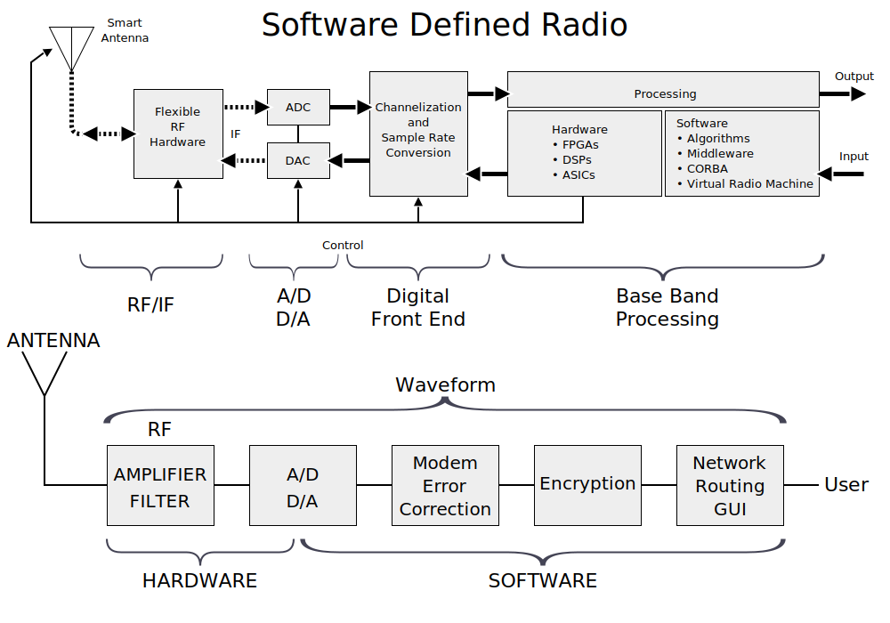

---
tags:
- computer science
- sdr
- software defined radio
---

# Software Defined Radio (SDR)

This theorie can be used in combination with the [RTL-SDR](./../../hw/rtl-sdr/index.md) Receiver and the [SDR++](./../../tools/sdr++/index.md) Software.

SDR is the abbreviation for Software Defined Radio. This means a radio – receiver, transmitter or transceiver – whose characteristics are determined by software. Certain sub-functions that used to be realized in hard-wired circuits are now handled on special, appropriately programmed hardware – DSPs, digital signal processors. And these can be reprogrammed to turn an FM demodulator into an SSB demodulator, a low-pass filter, a spectrum analyser or a combination of these, as required. In this way, an entire frequency band can also be stored digitally and played back later, just the same way as listening live.

Check out also [The ultimate SDR Guide](https://www.wimo.com/en/sdr).

{.center width="100%"}

## Frequency Bands

On the frequency band exploidable by common SDR are mentioned. See [Radio Spectrum](https://en.wikipedia.org/wiki/Radio_spectrum#ITU) for more informations

| Band   | Full Name                 | Frequewncy        | Wavelength     | Usage |
|--------|---------------------------|-------------------|----------------|-------|
| VLF    | Very Low Frequency        | $3KHz - 30KHz$    | $100km - 10km$ | [Navigation](https://en.wikipedia.org/wiki/Radio_navigation), [time signals])(https://en.wikipedia.org/wiki/Radio_clock), communication with submarines, landline telephony, wireless heart rate monitors, geophysics |
| LF     | Low Frequency             | $300KHz - 3MHz$   | $10km - 1km$   | [Navigation](https://en.wikipedia.org/wiki/Radio_navigation), [time signals])(https://en.wikipedia.org/wiki/Radio_clock), AM longwave broadcasting, RFID, [amateur radio or ham radio](https://en.wikipedia.org/wiki/Amateur_radio) |
| MF     | Medium Frequency          | $300KHz - 3MHz$   | $1000m - 100m$ | AM broadcasts, [amateur radio or ham radio](https://en.wikipedia.org/wiki/Amateur_radio), [avalanche beacons](https://en.wikipedia.org/wiki/Avalanche_transceiver), [MRI](https://en.wikipedia.org/wiki/Magnetic_resonance_imaging), [PET-Scan](https://en.wikipedia.org/wiki/Positron_emission_tomography) |
| HF     | High Frequency            | $3MHz - 30MHz$    | $100m - 10m$   | [Shortwave broadcasts](https://en.wikipedia.org/wiki/Shortwave_radio), [CB-Radio](https://en.wikipedia.org/wiki/Citizens_band_radio), [amateur radio or ham radio](https://en.wikipedia.org/wiki/Amateur_radio), [OTH Radar](https://en.wikipedia.org/wiki/Over-the-horizon_radar), RFID, [ALE](https://en.wikipedia.org/wiki/Automatic_link_establishment). [NVIS](https://en.wikipedia.org/wiki/Near_vertical_incidence_skywave), [CT scan](https://en.wikipedia.org/wiki/CT_scan), [MRI](https://en.wikipedia.org/wiki/Magnetic_resonance_imaging), [PET-Scan](https://en.wikipedia.org/wiki/Positron_emission_tomography), [ultrasound](https://en.wikipedia.org/wiki/Medical_ultrasound) |
| VHF    | Very High Frequency       | $30MHz - 300MHz$  | $10m - 1m$     | [FM broadcasts](https://en.wikipedia.org/wiki/FM_broadcasting), [TV-broadcasts](https://en.wikipedia.org/wiki/Television), [ATC](https://en.wikipedia.org/wiki/Air_traffic_control) [ground-to-aircraft and aircraft-to-aircraft](https://en.wikipedia.org/wiki/Aviation_communication), [amateur radio or ham radio](https://en.wikipedia.org/wiki/Amateur_radio), [CT scan](https://en.wikipedia.org/wiki/CT_scan), [MRI](https://en.wikipedia.org/wiki/Magnetic_resonance_imaging), [PET-Scan](https://en.wikipedia.org/wiki/Positron_emission_tomography), [ultrasound](https://en.wikipedia.org/wiki/Medical_ultrasound) |
| UHF    | Ultra High Frequency      | $300MHz - 3GHz$   | $100cm - 10cm$ | [Microwave Oven](https://en.wikipedia.org/wiki/Microwave_oven), [Radio Astronomy](https://en.wikipedia.org/wiki/Radio_astronomy), [Mobile Phones](https://en.wikipedia.org/wiki/Mobile_phone), [WLAN](), [Bluethoot](), [Zigbee](), [GPS](), [FRS Radio](), [GMRS Radio](), [Sattelite Phone L and S-Band]() |

{.center width="100%"}

## Swiss Frequency Allocation Plan

[National Frequency Allocation Plan](https://www.bakom.admin.ch/bakom/en/homepage/frequencies-and-antennas/national-frequency-allocation-plan.html) or get the [PDF](docs/NaFZ_2024_Allocations_Image_2024-01.pdf) directly

## Observable

## Interesting Bands

| Name             | Band                           | Frequency Range       | Description |
|------------------|--------------------------------|-----------------------|-------------|
| LW (Long Wave)   | VLF (Very Low Frequency)       | 148.5 - 283.5 kHz     | AM Radio Spectrum |
| MW (Medium Wave) | LF (Low Frequency)             | 285kHz - 1.7MHz       | AM & FM Radio Stations |
| SW (Short Wave)  | HF (High Frequency)            | 1.7MHz - 30MHz        | International Broadcasts |
| VHF              | VHF (Very High Frequency)      | 30MHz - 300MHz        | FM Radio, TV, Air Traffic Control |
| UHF              | UHF (Ultra High Frequency)     | 300MHz - 3GHz         | TV, Mobile Phones, GPS |

## Interesting Frequencies

| Name             | Frequency             | Type | Description |
|------------------|-----------------------|------|-------------|
| LW (Long Wave)   |                       |      | AM Radio Spectrum |
| MW (Medium Wave) |                       |      | AM & FM Radio Stations |
| SW (Short Wave)  |                       |      | International Broadcasts |
| VHF              |                       |      | FM Radio, TV, Air Traffic Control |
| UHF              |                       |      | TV, Mobile Phones, GPS |
