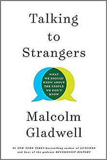

---
tags:
  - psychology
  - communication
---

# Communication

{.center width="20%"}

## Supercommunicators

{.center width="20%"}

My take and some ideas from the book [Supercommunicators](https://www.google.ch/books/edition/Supercommunicators/D9e_EAAAQBAJ?hl=de&gbpv=1&dq=supercommunicators&printsec=frontcover) by Charles Duhigg.

### Summary

1. **The Importance of Connection in Communication**: The book emphasizes that effective communication is fundamentally about connection. Supercommunicators understand how to create and maintain this connection through various types of conversations.
2. **Three Types of Conversations**:
    - **What’s This Really About?**: This type of conversation focuses on decision-making and understanding the practical aspects of a discussion.
    - **How Do We Feel?**: Emotional conversations are centered around expressing and understanding feelings.
    - **Who Are We?**: Social conversations revolve around identity, relationships, and how we see ourselves and others.
3. **The Matching Principle**: Effective communication requires recognizing the type of conversation occurring and matching your communication style to it. This involves aligning with the emotional tone, decision-making focus, or social dynamics of the conversation.
4. **Neural Entrainment**: The book discusses how successful communication often involves neural synchronization, where people’s brains and bodies align during meaningful conversations, leading to better understanding and connection.
5. **The Role of High Centrality Participants**: These are individuals who facilitate group conversations by asking questions, adapting to others’ moods, and ensuring everyone is heard. They are pivotal in creating group alignment and making everyone feel included.
6. **Communication as a Skill**: The book argues that anyone can learn to be a supercommunicator. It’s a set of skills that can be developed through practice, focusing on how to listen, ask the right questions, and align with others’ communication styles.

### The Four Rules for a Meaningful Conversation:

1. **Understand the Type of Conversation**:
    - Identify the Conversation Type: Before you engage in any conversation, take a moment to understand whether it’s a practical, emotional, or social conversation. This will help you tailor your communication approach appropriately.
    - Match the Conversation Style: Align your communication style to match the type of conversation. If it’s a decision-making discussion, focus on practical aspects; if it’s emotional, be empathetic and responsive to feelings.
2. **Ask Questions and Listen Actively**:
    - Ask More Questions: Supercommunicators ask a lot of questions to delve deeper into the other person’s thoughts and feelings. This not only shows interest but also helps in understanding the conversation better.
    - Listen for Clues: Pay close attention to what is said, how it’s said, and what remains unsaid. Active listening involves picking up on subtle cues that indicate the other person’s needs or emotions.
3. **Be Open and Vulnerable**:
    - Share Your Own Perspective: Don’t just listen—share your own feelings, experiences, and vulnerabilities. This openness encourages others to do the same, leading to a more authentic and meaningful connection.
    - Reciprocate Emotional Expression: When someone shares something personal, respond with your own experiences or emotions. This helps in building trust and deepening the conversation.
4. **Focus on Creating a Learning Conversation**:
    - Align Goals: Clarify what you want to achieve from the conversation and what the other person might want. This helps in steering the discussion towards a common understanding or agreement.
    - Encourage Mutual Understanding: Aim to learn from the conversation, not just to express your own viewpoint. Encourage the other person to share their perspective, and be open to adjusting your own based on what you learn.

### Some Tips
- Share your goals and intentions of the conversation and ask what others are seeking
- Ask questions to trigger emotional responses and self reflection
    - Why did you do this?
    - What was your idea behind this action?
- Ask the other how they feel about a something.
- Listen and repeat respectively summarize in own words until everyone agrees to the meaning.
- Try to find a common ground, an argument that both parties can agree on.
- Soften your own statements
- Find a common identity or goal to connect with the other person. It helps to avoid stereotypes and prejudices. and to feel closer to the other person.

## Talking to strangers

{.center width="20%"}

Malcolm Gladwell’s [Talking to Strangers](https://www.google.ch/books/edition/Talking_to_Strangers/FTiGDwAAQBAJ?hl=de&gbpv=0) explores how humans interact with unfamiliar people and the assumptions we make about each other. The book delves into why these assumptions often lead to misunderstandings, and how they can have serious consequences in everyday life and on a societal scale.

### Main Concepts

1. **Default to Truth** -
   People have an inherent tendency to believe others are telling the truth. This “default to truth” bias is a fundamental part of human communication, evolved to foster trust and cooperation. While this trait generally serves society well, it can also lead to dangerous misjudgments, especially when dealing with strangers.
   It is suggested that, although this bias can cause errors, a world without it would be chaotic and lead to widespread paranoia.
2. **Transparency Illusion** -
   People often assume that others’ emotions and intentions are transparent—what someone shows on the outside reflects what they feel inside. In reality, this assumption is flawed. In real life, unlike in sitcoms (such as Friends), where characters’ emotions are exaggerated and easy to interpret, people are much harder to “read,” and emotional expressions are not always reliable indicators of truth.
3. **The Problem of Mismatched Cues** -
   Some people are skilled liars and can deceive others with confidence, while truthful individuals might appear nervous or suspicious, leading to misunderstandings. In the examples such as the case of Neville Chamberlain and Adolf Hitler, where Chamberlain misread Hitler’s intentions because of Hitler’s apparent honesty and charm.
   Outward expressions, like confidence or nervousness, are unreliable cues for determining someone’s honesty or guilt. A more evidence-based approach in assessing others should be taken, focusing on facts rather than perceived transparency or demeanor.

### Key Insights:

- **Charisma and Deception** - Being charismatic and extroverted is not an indicator of truthfulness. Charismatic individuals can often be the most effective liars because they are skilled at manipulating others’ perceptions. In contrast, introverted or nervous people may struggle to convey the truth convincingly, causing others to doubt them unjustly.
- **Complexity of Communication** - Gladwell argues that we should be more cautious in our judgments of strangers, as our instincts to rely on transparency and trust are often misleading. Rather than relying on superficial impressions, we should seek out objective facts to make more informed decisions.
