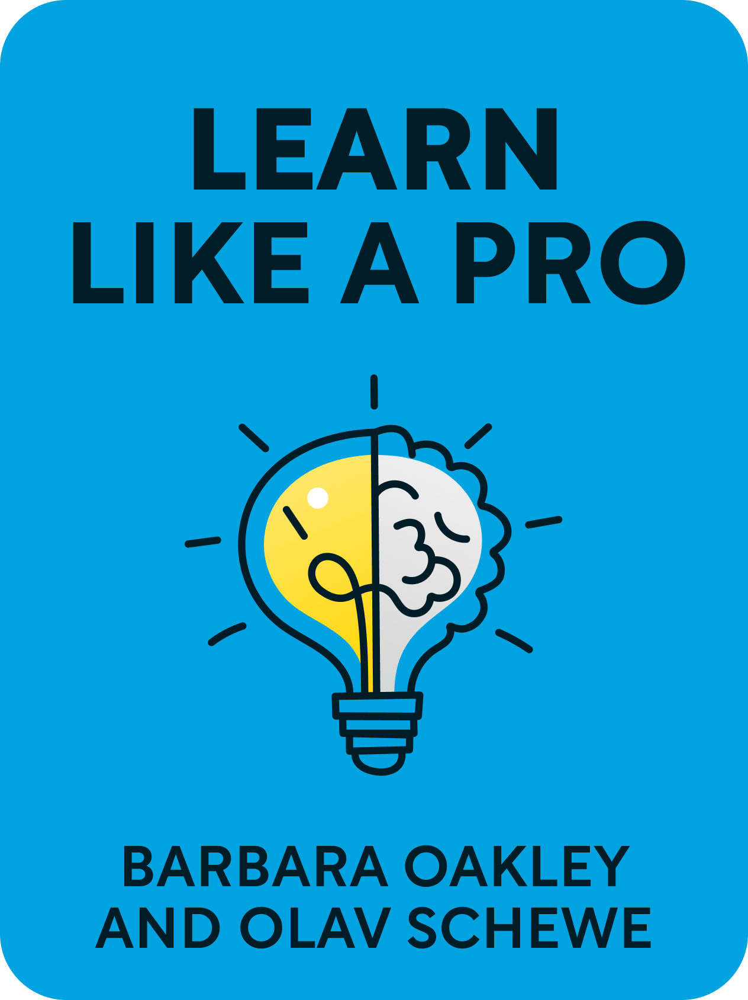

---
tags:
  - psychology
  - learning
---

# Leadership

{.center width="20%"}

## Focus vs Diffuse Mode
Focus and diffuse modes are two complementary ways our brain processes information. Focus mode is like a spotlight, enabling deep concentration on a specific task, ideal for problem-solving and learning new material. Diffuse mode, on the other hand, is more relaxed and broad, akin to a lantern spreading light in all directions. This mode allows the brain to make creative connections and see the bigger picture. Effective learning involves switching between these modes—using focus mode to tackle details and diffuse mode to integrate ideas and spark insights.

Focused Thinking             | Diffused Thinking
---------------------------- | -----------------
Narrow and targeted          | Broad and conceptual
Methodical and logical       | Intuitive and imaginative
Tactical and detail-oriented | Strategic and big-picture
Necessary for deep work      | Uncovers meaning and connections

The following methods can help you switch between focus and diffuse modes to enhance your learning.

### Pomodoro Technique
The Pomodoro Technique is a time management method that breaks work into intervals, typically 25 minutes long, separated by short breaks. This technique can help you maintain focus during study sessions and prevent burnout.

The work interval allows for focused thinking, while the break provides a chance to switch to diffuse thinking. It is important to give your brain rest during these breaks to make the new information shift into the Long-Term memory. Best are mundane tasks like walking, stretching, or meditating.

### Mind Mapping
Mind mapping is a powerful visual technique for organizing information and sparking creativity. By mapping out concepts, relationships, and ideas in a visual format, you engage both focus and diffuse modes of thinking. This approach not only simplifies complex topics but also helps connect ideas more effectively.

Personally, I’ve found mind maps invaluable for learning and structuring knowledge—I use MindManager to condense entire 100-page books into a single mind map. This method transforms dense material into an easily digestible, visually engaging format, making learning more efficient and memorable.

### Hard Start Technic
First analyse a work task and then start with the most difficult part. This way you can use the focus mode to solve the problem and then switch to the diffuse mode to see the bigger picture and make connections once you don't progress or getting tired in focused mode.

## Other Techniques

### Feynman Technique
The Feynman Technique is a method for learning and understanding complex topics by teaching them to someone else. By explaining a concept in simple terms, you can identify gaps in your knowledge and reinforce your understanding.

### Pair Learning
Pair learning involves studying with a partner or group to share ideas, ask questions, and discuss concepts. This collaborative approach can deepen your understanding of a topic and provide new perspectives.

### Metacognition
Metacognition is the awareness and understanding of your thought processes. By reflecting on how you learn and solve problems, you can improve your study habits and enhance your learning outcomes.

4-Step Model for self regulated learning

+ Make sure you understand the task
+ Plan how you will complete the task. Set clear goals and strategies.
    - To learn a language I want to learn 100 words in 2 weeks. I will use flashcards and repeat them every day twice for 10 mintues.
+ Begin learning with various technique as descibed in this page.
+ Check your progresss and self refelct the method your are using.

## Books and Resources

See also [Books](../multimedia/books/index.md#psychology) for more information.

| Cover                                                      | Book |
| ---------------------------------------------------------- | --- |
{align=right width=100px} | [Learning like a Pro](https://www.google.ch/books/edition/Learn_Like_a_Pro/-9f3DwAAQBAJ)
