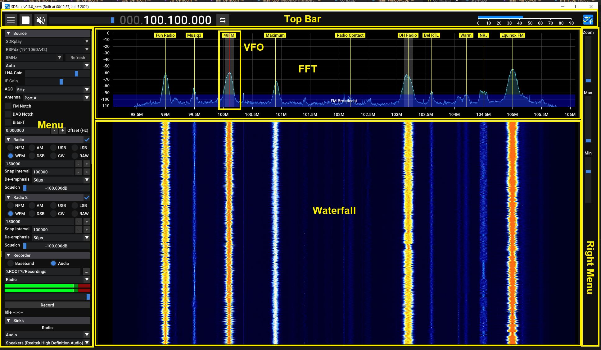

---
tags:
- tools
- sdr++
- rtl-sdr
---
# SDR++

{.center width="20%"}

Is a cross-platform (Windows, Linux, Mac) general-purpose receiver for Software Defined Radio (SDR) devices. It is designed for quick and easy testing and experimentation with [RTL-SDR](./../../hw/rtl-sdr/index.md), GNU Radio and HackRF. It is written in C++ and uses the Qt framework for its graphical interface.

For SDR Theory see the decicated [SDR](./../../computerscience/sdr/index.md) page.

The official [SDR++ Userguide](docs/sdr++-userguide.pdf) or the [latest online version](https://www.sdrpp.org/manual.pdf)

## Manual

- The top bar contains the controls and information that has to be accessed quickly.
- The side menu is where all the modules and settings are displayed.
- The FFT shows the strenght of the different frequencies and can have addition information overlayed (eq. band plans and bookmarks).
- The VFOs control where each demodulator is tuned to and what its bandwidths is (if the demodulator supports it).
- The waterfall shows the FFT over time.
- The right menu contains the controls for the waterfall and FFT.

{.center width="100%"}

The top bar contains the most important controls:

{.center width="100%"}

- The menu button allows to show or hide the side menu.
- The play/stop button is used to start/stop the source.
- The volume controls allow to adjust the volume (duh...) and/or mute the audio of the currently selected VFO.
- The frequency selector is used to tune the VFO and SDR to the desired frequency.
- The tuning mode select allows to switch between normal tuning (the offset of the VFO can change and the SDR only retunes when required) or center tuning (where the VFO stays in the middle and the SDR does all the work).
- The [SNR](https://en.wikipedia.org/wiki/Signal-to-noise_ratio) meter of the selected VFO ind $dB$.